# Campus Event Hub

Campus Event Hub is a full-stack web platform for discovering, organizing, and managing inter-college events. It gives students one place to browse events, register, receive tickets, and collect certificates, while giving college admins tools to create events, approve registrations, track attendance, and review feedback.

## Demo Video

Watch the project demo here:

[Campus Event Hub Demo Video](https://drive.google.com/file/d/1XTwaWpA63f1ko-XDaFKFxNUNNSLkTP4l/view?usp=sharing)

You can also click the preview below:

[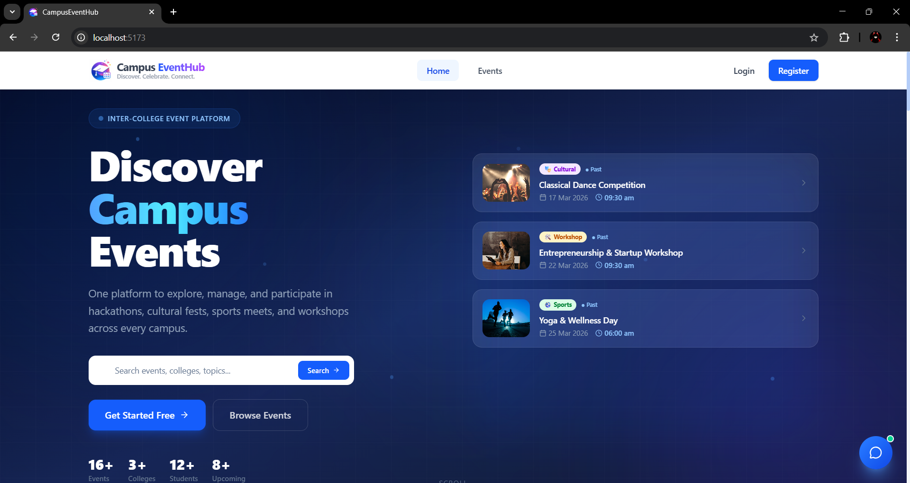](https://drive.google.com/file/d/1XTwaWpA63f1ko-XDaFKFxNUNNSLkTP4l/view?usp=sharing)

## Overview

This project uses a React frontend and an Express + MongoDB backend.

Users can:
- Browse upcoming events across colleges
- Register and manage their event participation
- View event tickets with QR-based check-in support
- Join event discussions and submit feedback
- Receive notifications for important activity

Admins can:
- Create and manage events
- Approve or reject registrations
- Mark attendance using QR scan or attendance code
- Export registration data in CSV, Excel, PDF, and JSON formats
- Monitor discussions, feedback, logs, and platform health

## Key Features

- Role-based access for `student`, `college_admin`, and `super_admin`
- JWT authentication with forgot-password flow
- Google OAuth login support
- Event creation with image upload
- Student registration and ticket generation
- QR check-in and attendance verification
- Certificate generation and PDF download
- Event discussions and replies
- Event feedback and analytics
- Real-time notifications with Server-Sent Events (SSE)
- Admin activity logs
- AI chatbot endpoint for event-related assistance

## Screenshots

### Home Page


### Events Pages

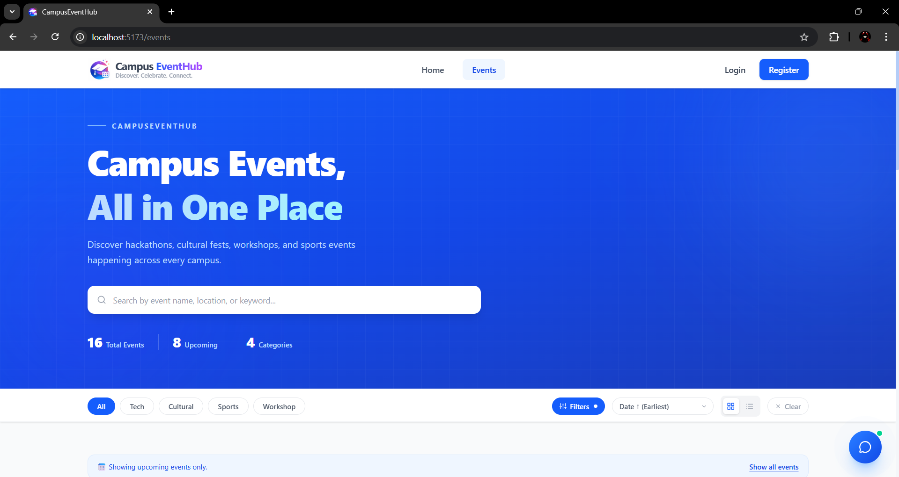
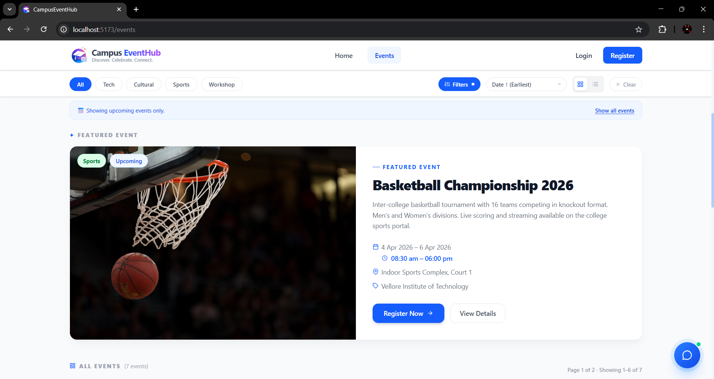


### Authentication Pages

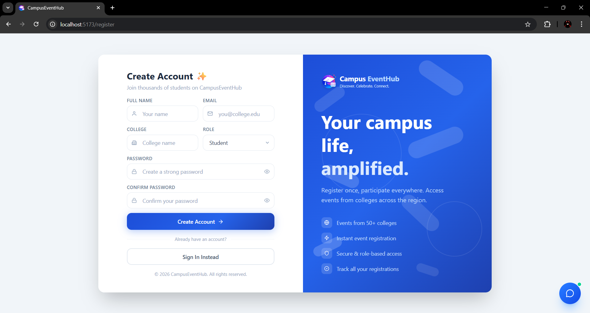
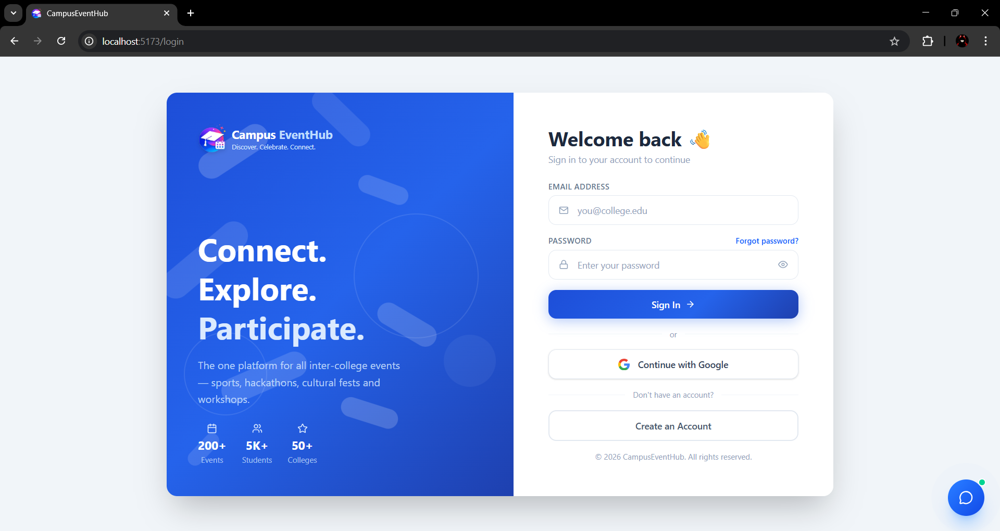

### Student Experience

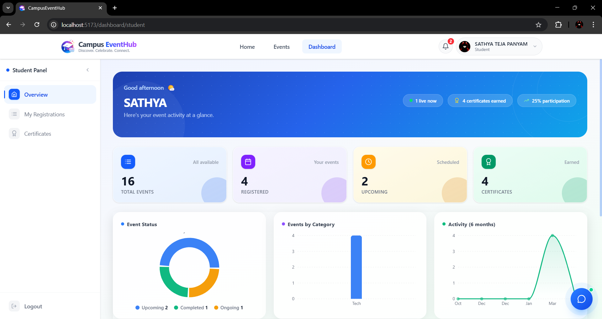
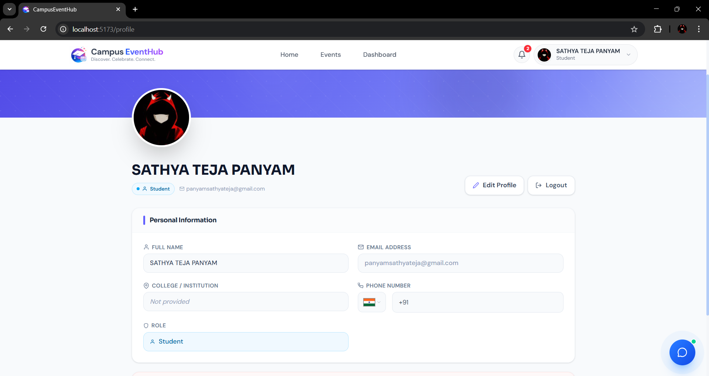
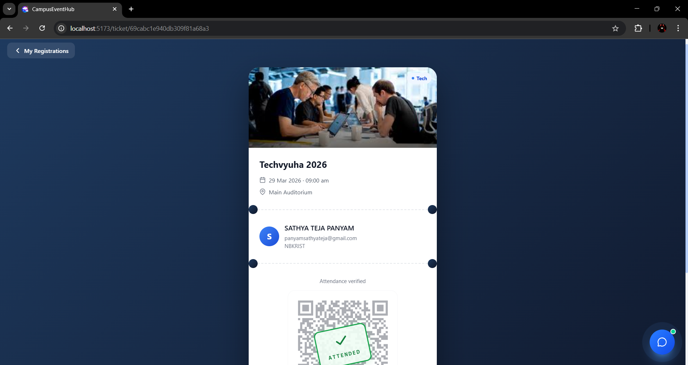
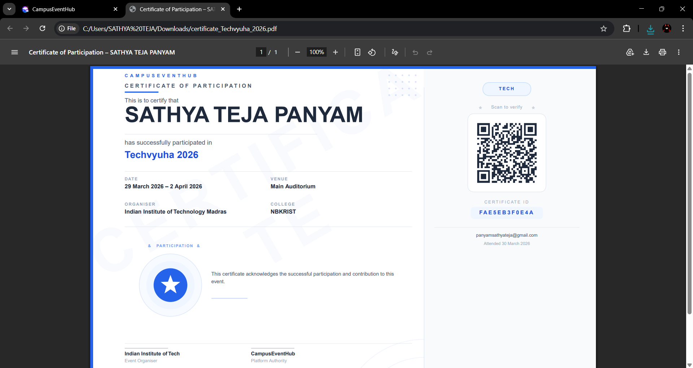
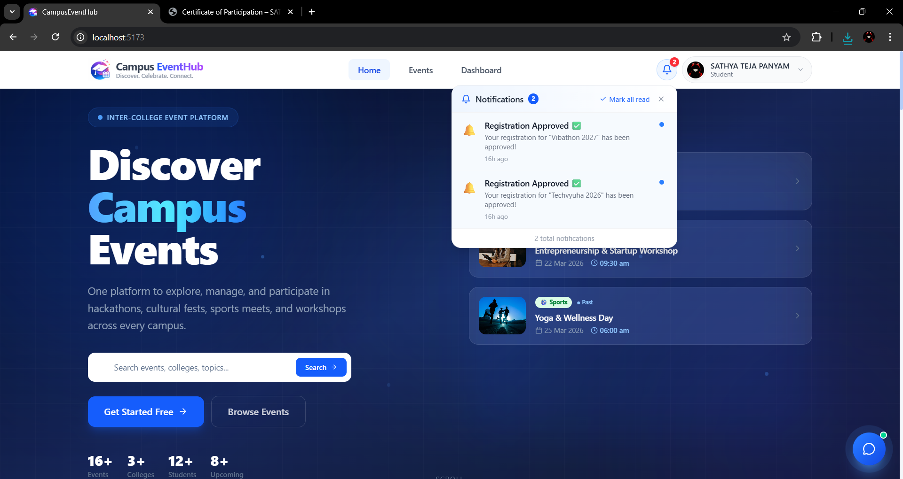
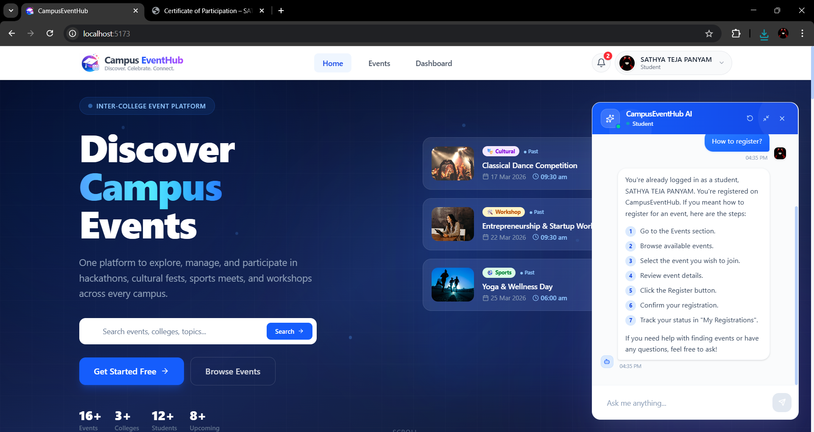

### Admin Dashboards

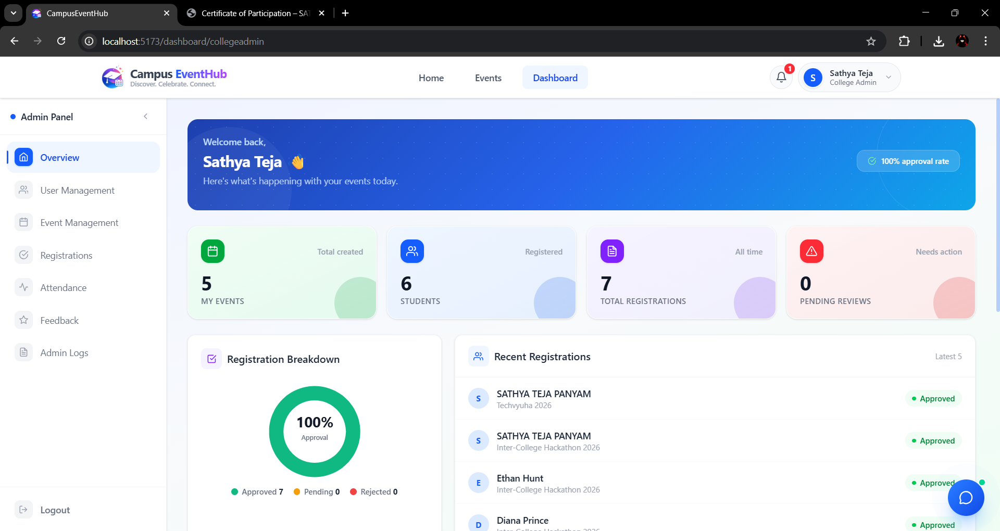
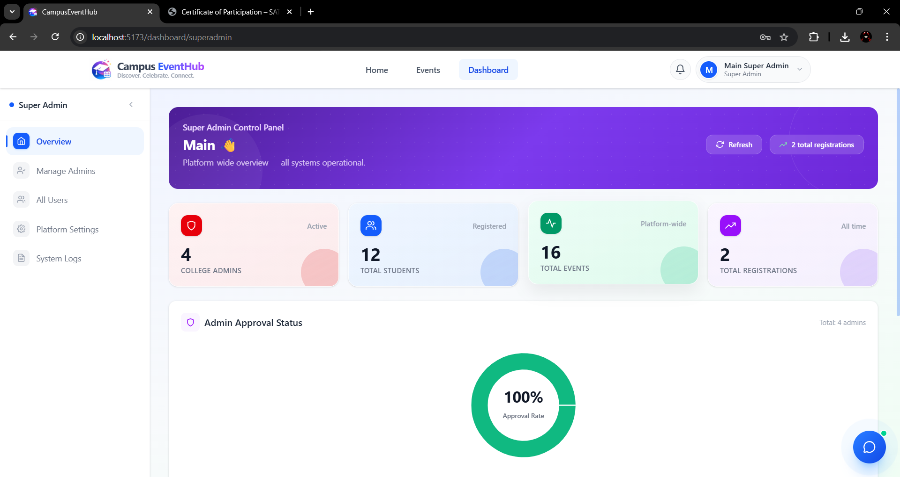

## Tech Stack

### Frontend
- React 19
- Vite
- React Router
- Tailwind CSS 4
- Framer Motion
- Axios
- Recharts

### Backend
- Node.js
- Express 5
- MongoDB + Mongoose
- JWT authentication
- Passport Google OAuth
- Multer for uploads
- Nodemailer
- PDFKit / ExcelJS / QRCode

## Project Structure

```text
Campus Event Hub/
|-- assets/
|   `-- screenshots/
|-- backend/
|   |-- src/
|   |   |-- config/
|   |   |-- controllers/
|   |   |-- middleware/
|   |   |-- models/
|   |   |-- routes/
|   |   |-- seed/
|   |   `-- services/
|   |-- uploads/
|   |-- package.json
|   `-- server.js
|-- frontend/
|   |-- public/
|   |-- src/
|   |   |-- components/
|   |   |-- context/
|   |   |-- hooks/
|   |   |-- pages/
|   |   `-- services/
|   `-- package.json
|-- docs/
|   |-- README.md
|   `-- java-backend-rebuild-spec.md
|-- LICENSE
`-- README.md
```

## User Roles

### Student
- Register and log in
- Browse events
- Register for events
- Access tickets and certificates
- Participate in discussions
- Submit feedback

### College Admin
- Create and update events
- Review registrations
- Mark attendance
- Export participant reports
- View feedback, discussions, and logs

### Super Admin
- Approve or reject college admin accounts
- View all users
- Access system health and platform-wide oversight tools

## Local Setup

### Prerequisites
- Node.js 18+
- npm
- MongoDB running locally or a MongoDB Atlas connection string

### 1. Clone the repository

```bash
git clone <your-repo-url>
cd "Campus Event Hub"
```

### 2. Install dependencies

```bash
cd backend
npm install

cd ..\frontend
npm install
```

## Environment Variables

Create `backend/.env` with the following values:

```env
PORT=5000
MONGO_URI=your_mongodb_connection_string
JWT_SECRET=your_jwt_secret
FRONTEND_URL=http://localhost:5173
BACKEND_URL=http://localhost:5000

EMAIL_USER=your_email_address
EMAIL_PASS=your_email_app_password

GOOGLE_CLIENT_ID=your_google_client_id
GOOGLE_CLIENT_SECRET=your_google_client_secret

GROQ_API_KEY=your_groq_api_key

SUPER_ADMIN_NAME=Super Admin
SUPER_ADMIN_EMAIL=superadmin@example.com
SUPER_ADMIN_PASSWORD=Password@123
```

Notes:
- `EMAIL_USER` and `EMAIL_PASS` are needed for approval, rejection, and password reset emails.
- `GOOGLE_CLIENT_ID` and `GOOGLE_CLIENT_SECRET` are needed only if you want Google login.
- `GROQ_API_KEY` is needed for the chatbot endpoint.
- Uploaded files are stored locally in `backend/uploads/`.

## Running the App

### Start the backend

```bash
cd backend
npm run dev
```

If you do not want auto-reload:

```bash
npm start
```

Backend runs at:

```text
http://localhost:5000
```

### Start the frontend

Open a second terminal:

```bash
cd frontend
npm run dev
```

Frontend runs at:

```text
http://localhost:5173
```

## Optional Seed Data

This repo includes seed scripts under `backend/src/seed/` for creating a super admin, sample college admins, students, events, and interactions.

Examples:

```bash
cd backend
node src/seed/superAdminSeed.js
node src/seed/collegeAdminsSeed.js
node src/seed/studentsSeed.js
node src/seed/seedEvents.js
node src/seed/interactionsSeed.js
```

## Demo Accounts

If you use the included seed files, these sample accounts are available:

### College Admins
- `john@gmail.com` / `Password@123`
- `emily@gmail.com` / `Password@123`

### Students
- `alice@gmail.com` / `Password@123`
- `bob@gmail.com` / `Password@123`
- Additional sample students are defined in `backend/src/seed/studentsSeed.js`

The super admin account is created from the `SUPER_ADMIN_*` environment variables.

## Important API Areas

Main backend route groups:
- `/api/auth`
- `/api/users`
- `/api/admin`
- `/api/events`
- `/api/registrations`
- `/api/discussions`
- `/api/feedback`
- `/api/notifications`
- `/api/certificates`
- `/api/admin-logs`
- `/api/health`
- `/api/chat`

Base health endpoint:

```text
GET /
```

Expected response:

```text
CampusEventHub API running
```

## Current Status

The application already includes:
- Authentication and role-based dashboards
- Event lifecycle management
- Registration approval workflows
- Attendance and ticketing
- Feedback, discussion, and notifications
- Admin logs and health monitoring
- Documentation for a possible Java backend rebuild in `docs/java-backend-rebuild-spec.md`

## Known Notes

- The frontend currently calls the backend at `http://localhost:5000`.
- Frontend API configuration is centralized in `frontend/src/services/api.js`.
- Environment files, uploads, and `node_modules` are already ignored by Git.
- There is currently no automated test suite configured in the root project.

## License

This project is licensed under the MIT License. See the `LICENSE` file for details.
